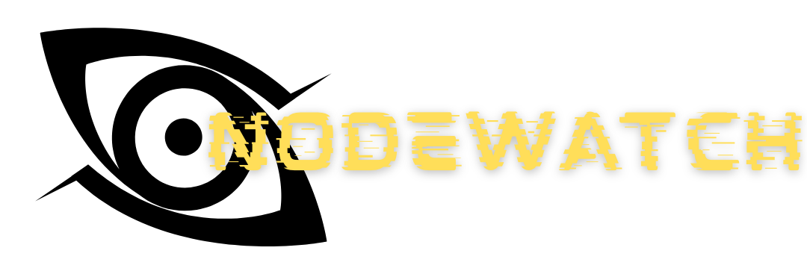

# NodeWatch - Network Observation & OSINT Threat-hunting Platform

<div align="center">
  
  

</div>

<div align="center">
  
[](https://flask.palletsprojects.com/en/stable/)
[](https://alpinejs.dev/)
[](https://visjs.org/)
[](https://leafletjs.com/)
[](https://ipquery.io/)

</div>

<hr>

<br>
<br>

<div align='center'>

 [](https://youtu.be/JX5Rtc5Ua7Q)


</div>

<br>
<br>

<div align="center">
  
***In an era dominated by automated security alerts and AI, NodeWatch reclaims the power of analyst intuition.***

</div>

NodeWatch is a host-based network observation and OSINT threat-hunting platform built around a single philosophy — the analyst decides, not the machine.
Unlike traditional security tools that rely on automated verdicts and machine-generated alerts, NodeWatch surfaces raw network data clearly and lets the human draw their own conclusions. Every indicator is a technical fact. Every conclusion is the analyst's own.

<br>
<br>

<hr>

<br>

# About

<br>

***What Does NodeWatch Do ?***

NodeWatch captures live host traffic using Scapy and streams it to an interactive browser dashboard in real time. Traffic is presented in two forms: a paginated packet table with search and filtering, and an interactive network graph mapping every IP relationship observed during the capture session.
For any external IP, the analyst can trigger on-demand OSINT enrichment via the IPQuery API returning geolocation, ASN, ISP, VPN,Tor,datacenter flags, a fraud risk score, and the geolocation plotted live on an interactive map. Every port links directly to the SANS Internet Storm Center for real-time community threat intelligence. Every service name links to contextual search. Every ASN links to an RDAP lookup engine.
No automated threat verdicts. No cloud dependency. No infrastructure. One command and you're hunting.

<br>
<br>

***What Tech Stack Does NodeWatch Use ?***

<br>

| Layer | Technology | Purpose
|-------|------------|--------|
| Packet Capture | Scapy | Live host traffic capture |
| Backend | Flask | Serves the dashboard |
| Real-time Streaming | Flask-SocketIO | Streams packets to the browser |
| Frontend | Alpine.js | Reactive UI state management | 
| Network Graph | vis.js | Interactive IP relationship mapping |
| Geolocation Map | Leaflet.js |Live IP geolocation plotting | 
| OSINT | IPQuery API | IP enrichment and risk scoring |
| Threat Intel | SANS Internet Storm Center | Port and IP threat intelligence |

<br>
<br>

***What Makes NodeWatch Different ?***

Most tools are desgined to be user friendly with interpretation done by complex alogrithims and detection engines, NodeWatch lets the user interpret the data, It provides all the context required for a human to make a judgement, at its current form NodeWatch is host based and monitors the nodes connecting to the host, its primary purpose is to present data in different forms providing different angles to look from and provide the tools to gain context and build the evidence to make judgement and interptetations, currently NodeWatch is an MVP only providing packets as table and network graph with only ipquery and hyperlinks to SANS Internet Storm Center as OSINT tools

<br>
<br>

***How Do I Run NodeWatch?***

NodeWatch requires root or administrator privileges for packet capture.

```bash

# 1. Clone the repo
git clone https://github.com/girishatindra/nodewatch.git
cd nodewatch

# 2. Create and activate a virtual environment
python -m venv venv
source venv/bin/activate        # Windows: venv\Scripts\activate

# 3. Install dependencies
pip install -r requirements.txt

# 4. Run the server
python app.py
```
Then open http://127.0.0.1:5000 in your browser, click Start, and begin capturing.

For a walkthrough of all features, watch the [demo](https://youtu.be/JX5Rtc5Ua7Q).

<br>
<br>

***Will NodeWatch Expand ?***

Yes, NodeWatch is deliberately designed as an expandable foundation. The current MVP establishes the core architecture and philosophy. Planned expansions include:

- Shodan & VirusTotal integration: deeper IP and domain intelligence
- AbuseIPDB integration: community-reported malicious IP feed
- PCAP and JSON export: save sessions for offline analysis
- Timestamps: per-packet timing for timeline reconstruction
- Additional visual representations: timeline view, protocol distribution charts
- BPF filter input: analyst-defined capture filters

The goal has always been the same: more context, more representations, more tools for the analyst to build evidence and make effective judgements.

<br>
<br>

***Why Is It Named NodeWatch ?***

The name points directly at the core function, observing the nodes communicating with the host and mapping their relationships. Watch, because the tool is passive by design. It observes. The analyst acts.

<br>
<br>

***Why Did I Build This ?***

It started as an idea for a lightweight SOC dashboard, but I wanted something with a distinct. While working with Scapy I noticed it leaves all interpretation to the user, it gives you the data and gets out of the way this desgin philosophy inspired me and became the foundation of NodeWatch.
Initially I planned to integrate Shodan and VirusTotal from the start, but launching a focused MVP with a clean codebase felt more valuable than overbuilding. The architecture is intentionally simple and extensible, every planned feature has a clear place to fit.
NodeWatch works best in controlled, lower-traffic environments where methodical human review is practical. For large-scale enterprise operations it would need significant expansion, but that's exactly what the roadmap is for.

<br>
<hr>
<br>

## :telephone_receiver: Contact
Have questions, feedback, or suggestions? Feel free to reach out:
-  [](mailto:girishatindra@gmail.com)
